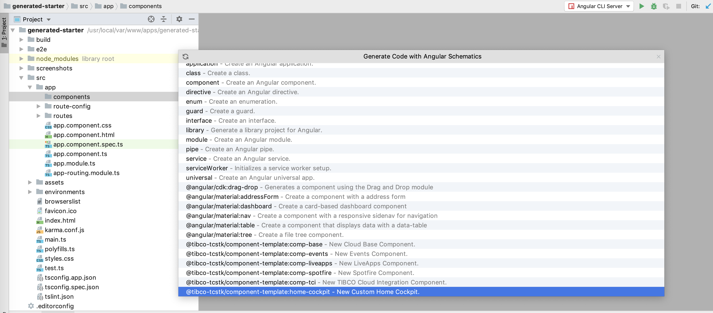
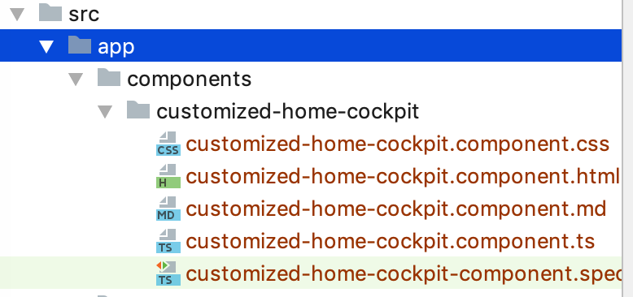

##Basic Developer Use Cases

###1 - Change Home Page layout

Developer wishes to change the look and feel of the home page component:
(Note initial release will include component schematics for home page, case page, config page, login page, splash page → more sub-components to follow)

1) Developer creates new home page component from schematic in editing tool or cmd line:

###2 - Change the logo

