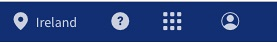
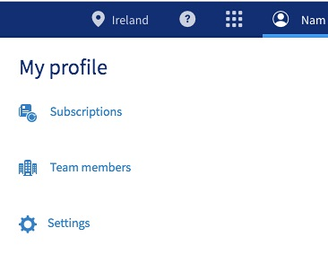
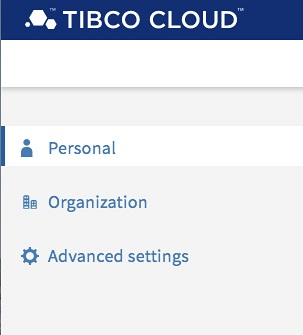
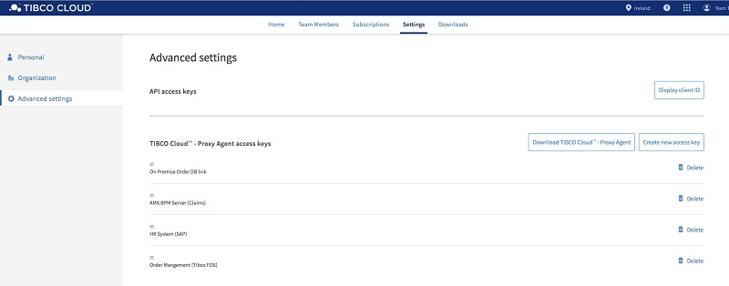
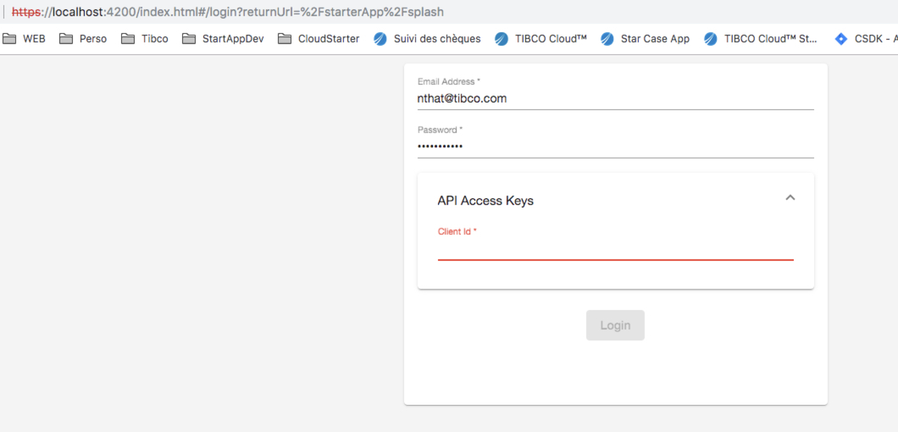
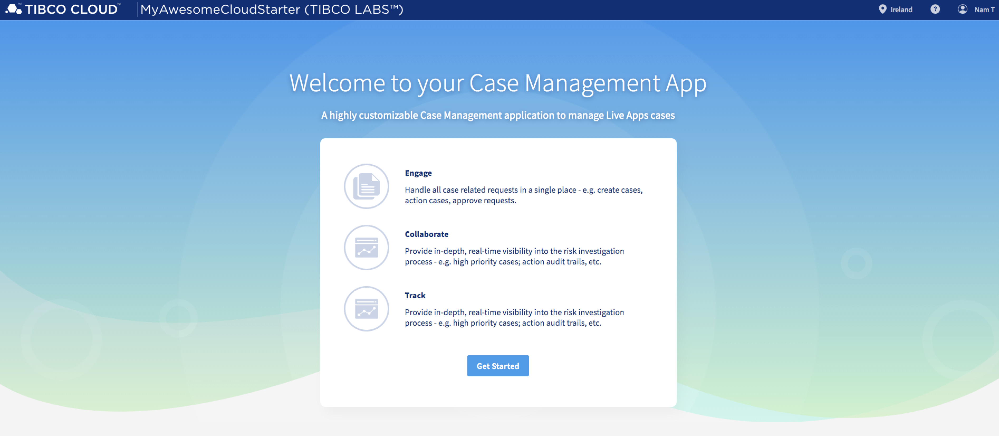

## Getting Started

You will find here a series of tutorials to help you get started and some more advanced subjects.

First of all, we want to get you started and get your environment ready with your own version of the Case Manager Application Template.


### Installation prerequisites

We are using Nodejs, NPM and Angular CLI, so you will have to install all of theses.

To check if you have NodeJS you can try
```console
node -v
```

[Install NodeJs](https://nodejs.org/en/download/package-manager/)

[Install Angular CLI](https://www.npmjs.com/package/@angular/cli)

#### Instructions for Mac 

#####1.) Using Homebrew you will get the latest version of NodeJS installed running this command
```console
brew install node
```
Note if you do not have Homebrew and have an error in the above command, install it with the following and re do the command after 
```console
xcode-select --install   
```

#####2.) Then install Angular CLI 
```console
npm install -g @angular/cli
```

#### Instructions for Windows 

get latest Windows Installer for Node.js and NPM from [here](https://nodejs.org/en/download/) and follow the Installer Steps.

Alternatives
Using Chocolatey:
```
cinst nodejs.install
```
Using Scoop:
```
scoop install nodejs
```

### Use Applicatiton Schematic Template from NPM

#####1.)  private NPM Server

Set the registry to the currently private TIBCO Cloud Starter NPM server, for the @tibco-tsctk scope:

```console
npm config set @tibco-tcstk:registry http://application-lb-npm-1392137160.eu-west-1.elb.amazonaws.com/
```

#####2.) Install the CaseManagement App Template

Install the application template on a global level

```console
   npm install -g @tibco-tcstk/application-template
```

#####3.) Build App

   Build a new cloud starter application using the template
   
   
```console
      ng new --collection=@tibco-tcstk/application-template MyAwesomeCloudStarter
```

#####4.) Start App

Go into Cloud Starter folder and start it up
Becarefull, you will need to use only one of the following series of commands depending on where your subscription is based 

The following command will let you use a Europe based subscription
```console
cd MyAwesomeCloudStarter/
npm run serve_eu
```

The following command will let you use a US based subscription
```console
cd MyAwesomeCloudStarter/
npm run serve_us
```
Now you can browse your Case Manager Application on: https://localhost:4200/

#####6.) Get your ClientID

When you will browse the Case Manager Application you will get ask your subscription Login (your email) and your password but also a ClientID (used as an double security key)

To get this ClientID :
 - Browse and log in Tibco Cloud with either :
 
      [EU subscription](https://eu.account.cloud.tibco.com/manage/home)
      
      [US subscription](https://account.cloud.tibco.com/manage/home)
 
 
 - Click on your name at the top right 
 
 
 
 
 - Click on "Settings"
 
 
 
 
 - Click on "Advanced Settings"
 
 
 
 
 - Click on the button to copy your ClientId
 
 
 

#####5.) Log in the app

Then you just have to log in with your credentials and the ClientId

 
 
 And you will get in the app
 
 


