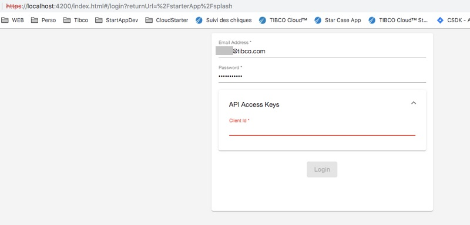
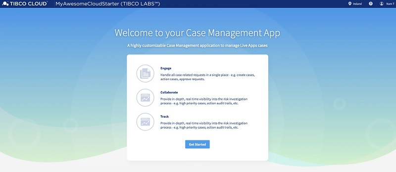

## Getting Started

You will find here a series of tutorials to help you get started and some more advanced subjects.

First of all, we want to get you started and get your environment ready with your own version of the Case Manager Application Template.


### Installation prerequisites

We are using Nodejs, NPM and Angular CLI, so you will have to install all of theses.


#### Instructions for Mac 

##### 1.) Test if you have NodeJS and NPM installed

To check if you have NodeJS and NPM you can try
```console
node -v
npm -v
```
if get back the latest Version Numbers, you can go to 3.)

##### 2.) Install NodeJS if 1.) failed
Using Homebrew you will get the latest version of NodeJS installed running this command
```console
brew install node
```

Note if you do not have Homebrew and have an error in the above command, install it with the following and re do the command after 
```console
xcode-select --install   
```

##### 3.) Then install Angular CLI 
Be carefully, your angular cli should be installed with -g (for global)


```console
npm install -g @angular/cli
```

Note : Depending on your installation, you might have to add sudo in front of the command if you run in any file access error

#### Instructions for Windows 

##### 1.) Test if you have NodeJS installed

To check if you have NodeJS and NPM you can try
```console
node -v
npm -v
```
if get back the latest Version Numbers, you can go to 3.)

##### 2.) Install NodeJS and NPM if 1.) failed

get latest Windows Installer for Node.js and NPM from [here](https://nodejs.org/en/download/) and follow the Installer Steps.

Alternatives
Using Chocolatey:
```
cinst nodejs.install
```
Using Scoop:
```
scoop install nodejs
```

##### 3.) Then install Angular CLI 
Be carefully, your angular cli should be installed with -g (for global)

```console
npm install -g @angular/cli
```

#### Reference websites

In case, here are the references websites

[Install NodeJs](https://nodejs.org/en/download/package-manager/)

[Install Angular CLI](https://www.npmjs.com/package/@angular/cli)


### Use Application Schematic Template from NPM

#### 1.)  private NPM Server

Set the registry to the currently private TIBCO Cloud Starter NPM server, for the @tibco-tsctk scope:

```console
npm config set @tibco-tcstk:registry http://application-lb-npm-1392137160.eu-west-1.elb.amazonaws.com/
```

#### 2.) Install the CaseManagement App Template

Install the application template on a global level

```console
   npm install -g @tibco-tcstk/application-template
```

Note : Depending on your installation, you might have to add sudo in front of the command if you run in any file access error

#### 3.) Build App

   Build a new cloud starter application using the template
   
   We are about to create the app, so please go to a folder where you want this app to be placed underneath
   Be careful, here we are using "MyAwesomeCloudStarter" to be the AppName, if you want to change it, you will have to remember it when reading subsequent tutorials
   
```console
      ng new --collection=@tibco-tcstk/application-template MyAwesomeCloudStarter
```

  Application is generated in the MyAwesomeCloudStarter folder created in the folder you are actually in

  You can now open the Application Code in your favorite Angular editor (we internally use Webstorm for example)


#### 4.) Start App

Go into Cloud Starter folder and start it up

Becarefull, you will need to use only one of the following series of commands depending on where your subscription is based 

The following command will let you use a Europe based subscription
```console
cd MyAwesomeCloudStarter/
npm run serve_eu
```

The following command will let you use a US based subscription
```console
cd MyAwesomeCloudStarter/
npm run serve_us
```

The following command will let you use a Asia based subscription
```console
cd MyAwesomeCloudStarter/
npm run serve_au
```

Now you can browse your Case Manager Application on: https://localhost:4200/

On first browse, you will get a security warning as the ssh certificate we give you for development phase is not signed, just clicked advanced and auhtorized to browse your local machine

#### 5.) Get your ClientID

When you will browse the Case Manager Application you will get ask your subscription Login (your email) and your password but also a ClientID (used as an double security key)

To get this ClientID :
 - Browse and log in Tibco Cloud with either :
 
      [EU subscription](https://eu.account.cloud.tibco.com/manage/home)
      
      [US subscription](https://account.cloud.tibco.com/manage/home)
      
      [AU subscription](https://au.account.cloud.tibco.com/manage/home)
 
 
 - Click on your name at the top right 
 
 
 
 
 - Click on "Settings"
 
 
 
 
 - Click on "Advanced Settings"
 
 
 
 
 - Click on "Display Client ID", then on  "Copy"
 
 
 

#### 6.) Log in the app

Then you just have to log in with your credentials and the ClientId

 
 
 And you will get in the app
 
 


