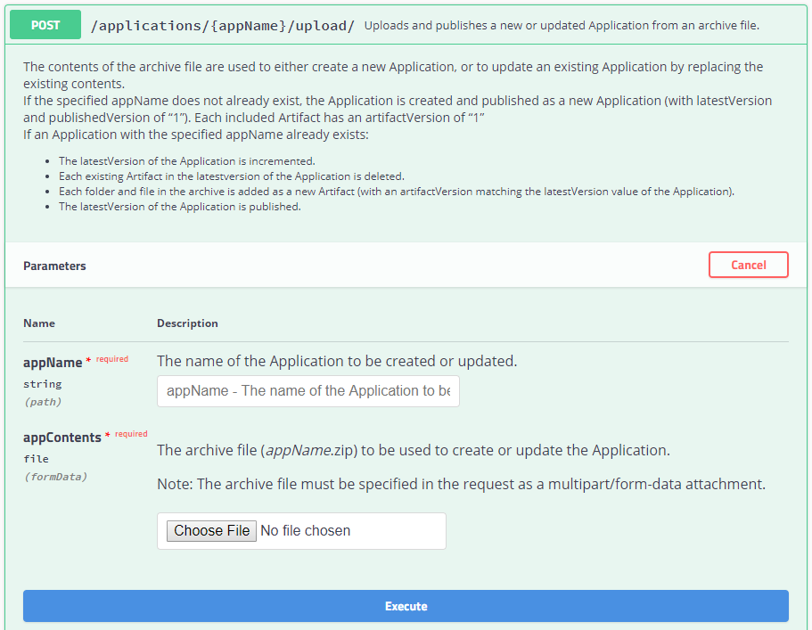
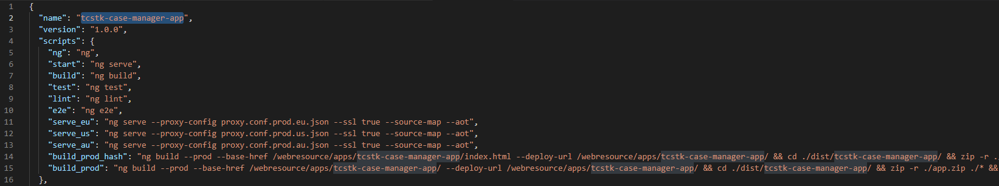
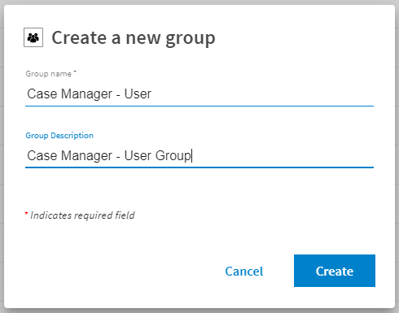

## Deployment

### Build
To make an App ready for Deployment you need to run

```
npm run build_prod
```

and a App Zip file is created into the 'dist' Folder.

#### Upload

Afterwards the Zip con be uploaded to TIBCO Cloud LiveApps Web Resource Provisioning (WRP) using the Swagger UI delivered within the API Documentation or using Postman.

Web Resource Provisioner Service (WRP) links below (depending on you subscription)

[EU POST /applications/{appName}/upload/](https://eu.liveapps.cloud.tibco.com/apps/api-explorer/index.html#/swaggerUi?feature=..~2Fyaml~2Fwr-v01.yaml)

[US POST /applications/{appName}/upload/](https://liveapps.cloud.tibco.com/apps/api-explorer/index.html#/swaggerUi?feature=..~2Fyaml~2Fwr-v01.yaml)

[AU POST /applications/{appName}/upload/](https://au.liveapps.cloud.tibco.com/apps/api-explorer/index.html#/swaggerUi?feature=..~2Fyaml~2Fwr-v01.yaml)

Just specify the 'AppName' with the value you specified when creating the app (should be "MyAwesomeCloudStarter") and select the App.zip File.



> Note: you have to choose the 'AppName' that is configured for your App Build in your package.json 
> eg. if just pull the 'TCSTK-Case-Manager-App' from GitHub the 'AppName' is ""



> Alternatively a CLI Tool can be used.

#### configure Users and Roles

For this Case Manager App two Groups can be configured for the following Roles

- Users (default all Users)
- Administrators (default all Users)

To Limit Access you can create own Groups in the Live Apps Administration UI and
grant access from the App Configurator View.



> For more Details check 'App Settings', too.


#### Browse the app

You can now browse the app there.
Be care full, this link is static (built on convention)
Also, you need to be logged on to the subscription you deployed it to (the login page will appear if you are not logged)

- For EU subscription

> https://eu.liveapps.cloud.tibco.com/webresource/apps/{appName}/index.html

- For US subscription

> https://liveapps.cloud.tibco.com/webresource/apps/{appName}/index.html

